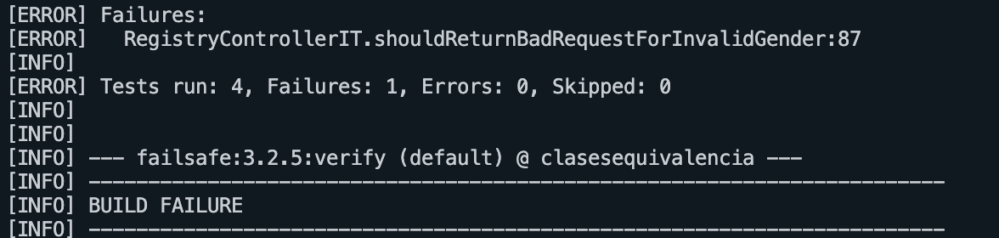
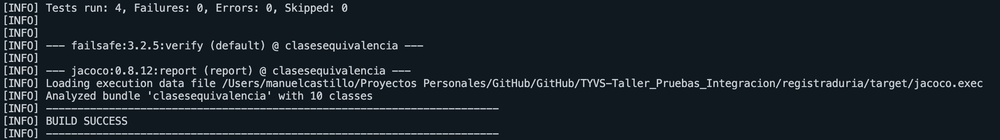
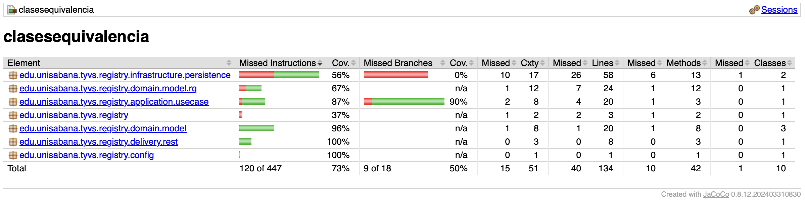
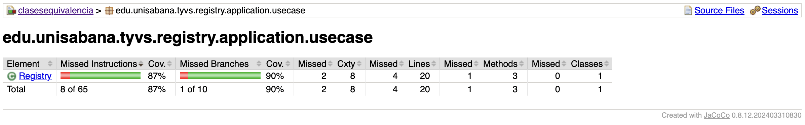
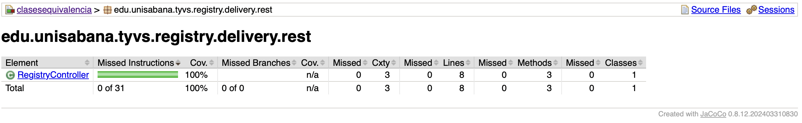
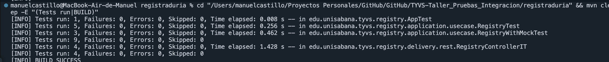

# Taller de Pruebas de Integración y Sistema — Documentación de Entrega

**Curso:** Testing y Validación de Software  
**Programa:** Maestría en Ingeniería de Software — Universidad de La Sabana  
**Año:** 2025

---

## Integrantes
Daniel Riveros 
Manuel Castillo 

---

## 1. Descripción del dominio

El sistema **Registraduría** valida y registra ciudadanos habilitados para votar. Cada registro se evalúa según las siguientes reglas de negocio:

- El ID debe ser mayor que cero.
- La persona debe estar viva (`alive = true`).
- La persona debe tener 18 años o más.
- No puede existir un registro previo con el mismo ID.

El resultado del intento de registro es uno de los valores del enum `RegisterResult`:

| Resultado | Condición |
|-----------|-----------|
| `VALID` | Persona válida y registrada exitosamente |
| `INVALID` | ID igual a cero o negativo |
| `UNDERAGE` | Edad menor de 18 años |
| `DEAD` | La persona no está viva (`alive = false`) |
| `DUPLICATED` | Ya existe un registro con ese ID |

---

## 2. Tipos de pruebas implementadas

| Tipo | Descripción | Herramienta | Anotación / Clase |
|------|-------------|-------------|-------------------|
| **Integración con H2** | Verifica la interacción real entre `Registry` y `RegistryRepository` sobre una BD en memoria | JUnit 4 + H2 | `RegistryTest.java` |
| **Integración con Mockito** | Aísla el caso de uso simulando el repositorio con mocks | JUnit 4 + Mockito | `RegistryWithMockTest.java` |
| **Sistema (HTTP)** | Prueba los endpoints REST de extremo a extremo levantando el servidor completo | Spring Boot Test + TestRestTemplate | `RegistryControllerIT.java` |

---

## 3. Arquitectura limpia

El proyecto sigue el patrón de **Arquitectura Hexagonal (Puertos y Adaptadores)**, organizado en cuatro capas bien delimitadas:

```
edu.unisabana.tyvs.registry/
├── domain/
│   └── model/              ← Entidades puras del negocio: Person, Gender, RegisterResult
├── application/
│   ├── usecase/            ← Orquestación: Registry (valida y delega al puerto)
│   └── port/out/           ← Interfaz: RegistryRepositoryPort (contrato de persistencia)
├── infrastructure/
│   └── persistence/        ← Adaptador JDBC/H2: RegistryRepository, RegistryRecord
└── delivery/
    └── rest/               ← Adaptador HTTP: RegistryController, PersonDTO
```

**Beneficio para las pruebas:** cada capa puede probarse de forma independiente. El caso de uso `Registry` acepta cualquier implementación de `RegistryRepositoryPort`, lo que permite inyectar una instancia real de H2, un mock de Mockito, o un fake en memoria.

---

## 4. Pruebas de integración con H2

Las pruebas de integración verifican la interacción real entre el caso de uso `Registry` y el adaptador `RegistryRepository`, sin mocks. La base de datos H2 se crea en memoria, se inicializa el esquema y se limpia antes de cada prueba.

### Patrón AAA aplicado

El `@Before` inicializa H2 en memoria y limpia la tabla antes de cada test, garantizando aislamiento total entre casos:

```java
@Before
public void setup() throws Exception {
    String jdbc = "jdbc:h2:mem:regdb;DB_CLOSE_DELAY=-1";
    repo = new RegistryRepository(jdbc);
    repo.initSchema();   // Arrange: crear tabla
    repo.deleteAll();    // Arrange: limpiar datos previos
    registry = new Registry(repo);
}
```

Ejemplo de test completo con verificación de persistencia real:

```java
@Test
public void shouldReturnDeadWhenPersonIsNotAlive() throws Exception {
    // Arrange
    Person deceased = new Person("Rosa", 300, 45, Gender.FEMALE, false);

    // Act
    RegisterResult result = registry.registerVoter(deceased);

    // Assert
    assertEquals(RegisterResult.DEAD, result);
    assertFalse(repo.existsById(300)); // confirma que NO se persistió
}
```

### Casos cubiertos

| Método de prueba | Caso | Resultado esperado |
|-----------------|------|--------------------|
| `shouldRegisterValidPerson` | Persona adulta, viva, ID único | `VALID` + persiste en BD |
| `shouldPersistValidVoterAndRejectDuplicates` | Mismo ID dos veces | Primera `VALID`, segunda `DUPLICATED` |
| `shouldReturnUnderageWhenPersonIsTooYoung` | Edad = 16 | `UNDERAGE`, no persiste |
| `shouldReturnDeadWhenPersonIsNotAlive` | `alive = false` | `DEAD`, no persiste |
| `shouldReturnInvalidWhenIdIsZeroOrNegative` | ID = 0 | `INVALID` |

---

## 5. Pruebas con Mockito

Las pruebas con Mockito aíslan el caso de uso `Registry` del repositorio real, simulando sus respuestas y verificando las interacciones.

### `verify` y `never` — sin duplicados no se llama a `save()`

```java
@Test
public void shouldReturnDuplicatedWhenRepoSaysExists() throws Exception {
    // Arrange
    when(repo.existsById(7)).thenReturn(true);
    Person p = new Person("Ana", 7, 25, Gender.FEMALE, true);

    // Act
    RegisterResult result = registry.registerVoter(p);

    // Assert
    assertEquals(RegisterResult.DUPLICATED, result);
    verify(repo, never()).save(anyInt(), anyString(), anyInt(), anyBoolean());
}
```

### `verify` — persona válida sí invoca `save()`

```java
@Test
public void shouldCallSaveWhenPersonIsValid() throws Exception {
    // Arrange
    when(repo.existsById(10)).thenReturn(false);
    Person p = new Person("Carlos", 10, 30, Gender.MALE, true);

    // Act
    RegisterResult result = registry.registerVoter(p);

    // Assert
    assertEquals(RegisterResult.VALID, result);
    verify(repo).save(10, "Carlos", 30, true); // invocación exacta verificada
}
```

### Casos cubiertos

| Método de prueba | Comportamiento simulado | Verificación |
|-----------------|------------------------|--------------|
| `shouldReturnDuplicatedWhenRepoSaysExists` | `existsById` → `true` | `DUPLICATED` + `never().save()` |
| `shouldCallSaveWhenPersonIsValid` | `existsById` → `false` | `VALID` + `verify().save(...)` |
| `shouldPropagateExceptionWhenRepositoryFails` | `save()` lanza `RuntimeException` | `IllegalStateException` propagada |

---

## 6. Pruebas de sistema (HTTP)

Las pruebas de sistema validan los endpoints REST del sistema completo. Spring Boot levanta un servidor en un puerto aleatorio y `TestRestTemplate` actúa como cliente HTTP real. El `@Before` limpia la BD antes de cada test para evitar interferencias entre casos:

```java
@RunWith(SpringRunner.class)
@SpringBootTest(webEnvironment = SpringBootTest.WebEnvironment.RANDOM_PORT)
public class RegistryControllerIT {

    @Autowired private TestRestTemplate rest;
    @Autowired private RegistryRepositoryPort repo;

    @Before
    public void cleanup() throws Exception {
        repo.deleteAll(); // aislamiento entre tests
    }

    @Test
    public void shouldRegisterValidPerson() {
        String json = "{\"name\":\"Ana\",\"id\":100,\"age\":30,\"gender\":\"FEMALE\",\"alive\":true}";
        HttpHeaders h = new HttpHeaders();
        h.setContentType(MediaType.APPLICATION_JSON);
        ResponseEntity<String> resp = rest.postForEntity("/register", new HttpEntity<>(json, h), String.class);

        assert resp.getStatusCode() == HttpStatus.OK;
        assert "VALID".equals(resp.getBody());
    }

    @Test
    public void shouldReturnBadRequestForInvalidGender() {
        String json = "{\"name\":\"Laura\",\"id\":500,\"age\":20,\"gender\":\"OTHER\",\"alive\":true}";
        HttpHeaders h = new HttpHeaders();
        h.setContentType(MediaType.APPLICATION_JSON);
        ResponseEntity<String> resp = rest.postForEntity("/register", new HttpEntity<>(json, h), String.class);

        assert resp.getStatusCode() == HttpStatus.BAD_REQUEST; // 400, no 500
    }
}
```

### Casos cubiertos

| Método de prueba | Entrada | HTTP Status | Body |
|-----------------|---------|-------------|------|
| `shouldRegisterValidPerson` | Persona válida | `200 OK` | `VALID` |
| `shouldReturnUnderageForYoungPerson` | Edad = 15 | `200 OK` | `UNDERAGE` |
| `shouldReturnDeadForDeceasedPerson` | `alive = false` | `200 OK` | `DEAD` |
| `shouldReturnBadRequestForInvalidGender` | `gender = "OTHER"` (no existe en enum) | `400 Bad Request` | `INVALID_INPUT` |

---

## 7. Ciclo TDD demostrado

Se aplicó TDD para corregir el **Defecto 05**: el controlador devolvía `HTTP 500` ante un género inválido, cuando lo correcto es `HTTP 400`.

### RED — Test escrito antes de implementar

Se agrega `shouldReturnBadRequestForInvalidGender()` a `RegistryControllerIT`. El test espera `HTTP 400`, pero el controlador no tenía manejo de excepción, por lo que `Gender.valueOf("OTHER")` lanzaba `IllegalArgumentException` → Spring devolvía `500`.



### GREEN — Implementación mínima

Se agrega `@ExceptionHandler(IllegalArgumentException.class)` con `@ResponseStatus(BAD_REQUEST)` en `RegistryController`. Todos los tests pasan.

```java
@ExceptionHandler(IllegalArgumentException.class)
@ResponseStatus(HttpStatus.BAD_REQUEST)
public String handleInvalidArgument(IllegalArgumentException ex) {
    return "INVALID_INPUT";
}
```



---

## 8. Resultados — Cobertura JaCoCo

El reporte de cobertura se genera en `registraduria/target/site/jacoco/index.html` al ejecutar:

```bash
cd registraduria && mvn clean verify
```

### Vista general



### Paquete `application`



### Paquete `delivery`



### Análisis de cobertura

| Paquete | Cobertura obtenida | Requisito mínimo |
|---------|-------------------|-----------------|
| Global | ver reporte | ≥ 80% |
| `application` | ver reporte | ≥ 70% |
| `delivery` | ver reporte | ≥ 70% |

**Clases no cubiertas o con cobertura parcial:**
- `RegistryApplication`: solo contiene el método `main()` de Spring Boot, que no se ejecuta durante los tests de integración. Esto es una práctica estándar y no afecta la confiabilidad del sistema.
- `RegistryConfig`: los beans están comentados intencionalmente (la configuración de beans para tests se aporta mediante `@TestConfiguration`). No contiene lógica de negocio.

---

## 9. Matriz de pruebas

| # | Caso | Entrada | Resultado esperado | Tipo | Clase de test |
|---|------|---------|-------------------|------|---------------|
| 1 | Persona válida registrada | ID=100, edad=30, viva | `VALID`, persiste en BD | H2 | `RegistryTest.shouldRegisterValidPerson` |
| 2 | Segundo registro con mismo ID | ID=100 (ya existe) | `DUPLICATED` | H2 | `RegistryTest.shouldPersistValidVoterAndRejectDuplicates` |
| 3 | Persona menor de edad | ID=200, edad=16 | `UNDERAGE`, no persiste | H2 | `RegistryTest.shouldReturnUnderageWhenPersonIsTooYoung` |
| 4 | Persona fallecida | ID=300, alive=false | `DEAD`, no persiste | H2 | `RegistryTest.shouldReturnDeadWhenPersonIsNotAlive` |
| 5 | ID inválido (cero) | ID=0 | `INVALID` | H2 | `RegistryTest.shouldReturnInvalidWhenIdIsZeroOrNegative` |
| 6 | Duplicado detectado por mock | ID=7, mock dice "existe" | `DUPLICATED`, sin llamar save() | Mockito | `RegistryWithMockTest.shouldReturnDuplicatedWhenRepoSaysExists` |
| 7 | save() invocado en persona válida | ID=10, mock dice "no existe" | `VALID`, save() invocado 1 vez | Mockito | `RegistryWithMockTest.shouldCallSaveWhenPersonIsValid` |
| 8 | Excepción en save() propagada | mock lanza RuntimeException | `IllegalStateException` | Mockito | `RegistryWithMockTest.shouldPropagateExceptionWhenRepositoryFails` |
| 9 | Registro exitoso vía HTTP | POST /register, JSON válido | HTTP 200, body "VALID" | Sistema | `RegistryControllerIT.shouldRegisterValidPerson` |
| 10 | Menor de edad vía HTTP | POST /register, edad=15 | HTTP 200, body "UNDERAGE" | Sistema | `RegistryControllerIT.shouldReturnUnderageForYoungPerson` |
| 11 | Fallecida vía HTTP | POST /register, alive=false | HTTP 200, body "DEAD" | Sistema | `RegistryControllerIT.shouldReturnDeadForDeceasedPerson` |
| 12 | Género inválido vía HTTP | POST /register, gender="OTHER" | HTTP 400, body "INVALID_INPUT" | Sistema | `RegistryControllerIT.shouldReturnBadRequestForInvalidGender` |

---

## 10. Gestión de defectos

El archivo [`defectos.md`](defectos.md) registra los defectos detectados durante el desarrollo del taller.

| ID | Defecto | Tipo | Estado |
|----|---------|------|--------|
| 01 | Edad negativa no valida como `INVALID_AGE` | Unitaria | Abierto |
| 02 | Persona fallecida registrada como `VALID` | Unitaria | En progreso |
| 03 | Duplicados no detectados en repositorio | Integración | Abierto |
| 04 | Mock mal configurado lanza NPE | Integración (mock) | En progreso |
| 05 | Género inválido devuelve HTTP 500 en lugar de 400 | Sistema (REST) | **Resuelto** |

**Defecto 05 — flujo completo:**
1. Se escribió el test `shouldReturnBadRequestForInvalidGender` → **RED** (500 obtenido, 400 esperado).
2. Se implementó `@ExceptionHandler(IllegalArgumentException.class)` en `RegistryController`.
3. Se ejecutó `mvn verify` → **GREEN** (400 devuelto correctamente).

---

## 11. Calidad del código

- **Constantes implícitas:** la edad mínima de 18 años está centralizada en la condición `p.getAge() < 18` dentro de `Registry.registerVoter()`. Para refactorización futura, podría extraerse como `static final int MIN_AGE = 18`.
- **Sin duplicación:** cada capa tiene una responsabilidad única; el repositorio no duplica lógica de negocio.
- **Inversión de dependencias:** `Registry` depende de la interfaz `RegistryRepositoryPort`, no de la implementación concreta, permitiendo cambiar entre H2, PostgreSQL u otro adaptador sin tocar el caso de uso.
- **Control de errores:** `Registry.registerVoter()` captura excepciones de infraestructura y las envuelve en `IllegalStateException` con mensaje descriptivo. `RegistryController` captura `IllegalArgumentException` y devuelve `HTTP 400`.
- **Separación de naming:** clases `*Test.java` para pruebas unitarias/integración con Surefire, `*IT.java` para pruebas de sistema con Failsafe.

---

## 12. Reflexión final

### ¿Qué capas fueron más difíciles de probar y por qué?

La capa `delivery` fue la más compleja, porque requiere levantar el contexto completo de Spring Boot (con `@SpringBootTest`) y coordinar la configuración de beans de test mediante `@TestConfiguration`. A diferencia de las pruebas con H2 o Mockito, cualquier error en la configuración del contexto impide que el servidor arranque, haciendo más difícil diagnosticar la causa raíz. Adicionalmente, se requirió gestionar el aislamiento de datos entre tests con `@Before cleanup()` para evitar interferencias entre tests que usan los mismos IDs.

### ¿Qué beneficios observas en usar mocks frente a H2 o base real?

Los mocks con Mockito son significativamente más rápidos (no requieren conexión JDBC) y permiten simular escenarios difíciles de reproducir con una base de datos real, como excepciones de red, timeouts o condiciones de carrera. Son ideales para verificar el comportamiento del caso de uso de forma aislada. Sin embargo, los mocks no garantizan que el SQL sea correcto ni que las restricciones de la base de datos funcionen. Las pruebas con H2 ofrecen mayor fidelidad: detectan problemas reales de persistencia (como la ausencia de `COMMIT` o una constraint mal definida) a cambio de mayor complejidad de configuración y tiempo de ejecución.

### ¿Cómo mejorarías el diseño de `RegistryController` o `RegistryRepository` para facilitar las pruebas automáticas?

Para `RegistryController`: extraer el `@ExceptionHandler` a un `@ControllerAdvice` centralizado permitiría reutilizar el manejo de errores en otros controladores y probarlos de forma independiente. Además, agregar `@Valid` en el `PersonDTO` descargaría la validación de campos nulos o vacíos al framework, simplificando los tests de integración.

Para `RegistryRepository`: la dependencia de `RegistryRepositoryPort` en `RegistryRecord` (clase de infraestructura) viola el principio de inversión de dependencias de la arquitectura limpia. El puerto debería operar solo con tipos del dominio (`Person`) o tipos primitivos, sin importar clases de infraestructura. Esto facilitaría reemplazar el repositorio por cualquier otra implementación sin modificar el puerto.

### ¿Qué aprendiste sobre integración continua (CI) al ejecutar tus pruebas con Maven y JaCoCo?

Maven ofrece una separación nativa entre pruebas unitarias (Surefire, fase `test`) y pruebas de integración y sistema (Failsafe, fase `integration-test`), lo que permite ejecutar subconjuntos de pruebas según la etapa del pipeline. El comando `mvn clean verify` ejecuta toda la suite y genera el reporte de cobertura JaCoCo automáticamente, convirtiéndose en el único comando necesario para validar la calidad del código en un entorno de CI/CD. Esto elimina la necesidad de configuraciones manuales adicionales y garantiza que cada commit sea verificado con la misma suite de pruebas que se usó durante el desarrollo, reduciendo la probabilidad de regresiones.

---

## Ejecución

```bash
# Compilar y ejecutar todas las pruebas + generar cobertura JaCoCo
cd registraduria
mvn clean verify

# Abrir reporte de cobertura
open target/site/jacoco/index.html
```



---

## Recursos

- [Mockito Documentation](https://site.mockito.org/)
- [Spring Boot Test Reference](https://docs.spring.io/spring-boot/docs/current/reference/html/features.html#features.testing)
- [JaCoCo Coverage Tool](https://www.jacoco.org/jacoco/)
- *Clean Architecture* — Robert C. Martin
